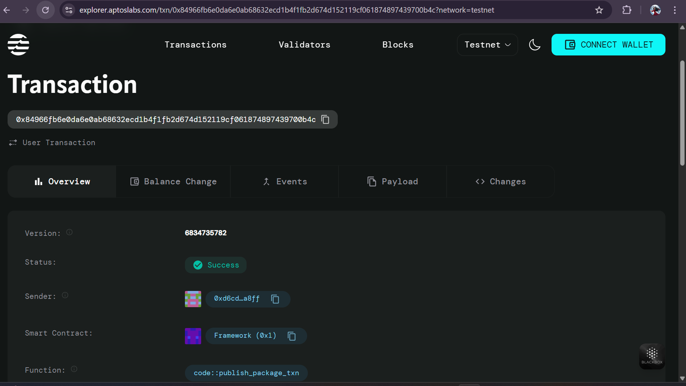

# Token with Supply Cap

## Project Description

This smart contract implements a token system with maximum supply limits and controlled minting functionality on the Aptos blockchain. The contract ensures that the total token supply never exceeds a predefined maximum limit, providing scarcity and controlled inflation mechanisms. Only the contract owner has the authority to mint new tokens, ensuring centralized control over token creation while maintaining transparency through blockchain immutability.

## Project Vision

Our vision is to create a robust and secure token infrastructure that addresses the common issues of unlimited token supply and uncontrolled inflation. By implementing strict supply caps and controlled minting mechanisms, we aim to:

- **Preserve Value**: Ensure token scarcity through hard-coded supply limits
- **Prevent Inflation**: Control token creation to maintain economic stability
- **Ensure Security**: Implement owner-only minting to prevent unauthorized token creation
- **Provide Transparency**: Leverage blockchain technology for complete transaction visibility
- **Enable Trust**: Build confidence through immutable smart contract rules

This project serves as a foundation for creating stable, valuable digital assets that can be used in various DeFi applications, gaming ecosystems, or as utility tokens for specific platforms.

## Key Features

### 🔒 **Supply Cap Enforcement**
- Hard-coded maximum supply limit that cannot be exceeded
- Automatic validation during minting operations
- Protection against accidental or malicious over-minting

### 👑 **Controlled Minting**
- Only contract owner can mint new tokens
- Granular control over token distribution
- Owner verification for every mint operation

### 📊 **Balance Management**
- Individual user balance tracking
- Automatic balance initialization for new users
- Secure balance updates with proper validation

### 🎯 **Event Emission**
- MintEvent: Tracks all token minting activities
- TransferEvent: Records token transfer operations
- Complete audit trail for all token operations

### 🛡️ **Security Features**
- Multiple error codes for different failure scenarios
- Input validation and access control
- Prevents common smart contract vulnerabilities

### 📈 **Token Information**
- Customizable token name and symbol
- Real-time total supply tracking
- Maximum supply visibility

## Future Scope

### Phase 1: Enhanced Functionality
- **Transfer Function**: Implement peer-to-peer token transfers
- **Burn Mechanism**: Allow token holders to burn their tokens
- **Allowance System**: Enable third-party spending approvals

### Phase 2: Advanced Features
- **Multi-signature Minting**: Require multiple signatures for large mints
- **Time-locked Minting**: Schedule future token releases
- **Minting Limits**: Set daily/monthly minting caps

### Phase 3: DeFi Integration
- **Staking Rewards**: Integrate with staking mechanisms
- **Liquidity Pool Support**: Enable DEX integration
- **Yield Farming**: Support for yield generation protocols

### Phase 4: Governance
- **DAO Integration**: Community-driven decision making
- **Voting Rights**: Token-based governance system
- **Proposal Management**: On-chain governance proposals

### Phase 5: Interoperability
- **Cross-chain Bridges**: Enable multi-chain functionality
- **Wrapped Tokens**: Support for wrapped token variants
- **Oracle Integration**: Real-world data integration

## Contract Details

0x84966fb6e0da6e0ab68632ecd1b4f1fb2d674d152119cf061874897439700b4c

